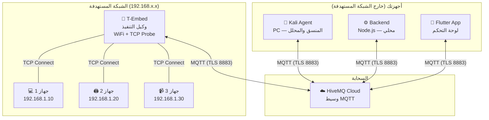
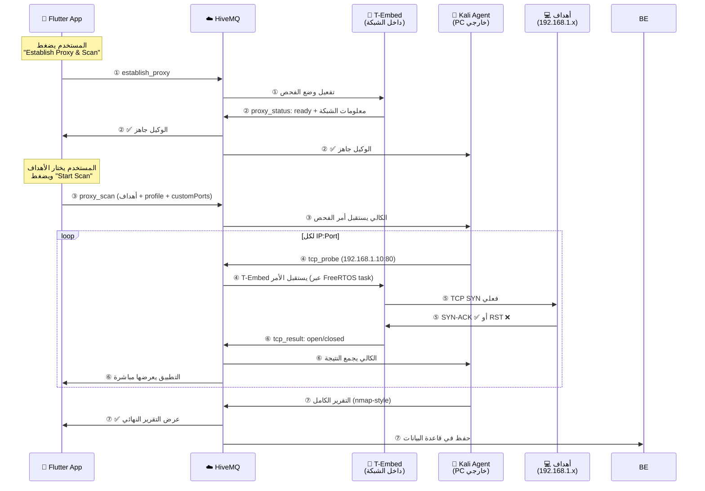

# Establish Proxy & Deep Scan — T-Embed كوكيل تنفيذ للكالي

## الهدف

الكالي (على PC خارج الشبكة) يرسل أوامر فحص عميق عبر MQTT → T-Embed (داخل الشبكة المستهدفة) ينفذ الفحص فعلياً → النتائج ترجع للكالي والتطبيق لحظة بلحظة.

## البنية الفعلية

> [!NOTE]
> **لا يوجد Railway أو VPS أو سيرفرات سحابية.** كل شيء يمر عبر HiveMQ فقط.
> الـ Backend يشتغل محلي على جهازك. الكالي على PC منفصل. التطبيق على جوالك.

---

## كيف يعمل النظام

### المراحل ببساطة:
1. **التفعيل**: التطبيق يرسل أمر → T-Embed يُفعّل وضع الفحص ويرد "جاهز"
2. **الفحص**: الكالي ينسق → T-Embed يفحص البورتات فعلياً (TCP Connect) في خلفية النظام (Anti-Blocking) → النتائج ترجع لحظة بلحظة
3. **التقرير**: الكالي يجمع كل النتائج ويكتب تقرير → يظهر في التطبيق + يُحفظ في DB

---

## MQTT Topics الحالية والمستخدمة

| Topic | المُرسل | المُستقبل | الوصف |
|-------|---------|-----------|-------|
| `mwfa/commands/tembed01` | App/Kali | T-Embed | أوامر: `establish_proxy`, `tcp_probe`, `port_scan`, `stop_proxy` |
| `mwfa/commands/kali01` | App | Kali | أوامر: `scan` (Direct), `proxy_scan` (Deep Scan) |
| `mwfa/tembed01/proxy_status` | T-Embed | App, Kali, Backend | حالة الوكيل: `ready` / `scanning` / `stopped` |
| `mwfa/tembed01/tcp_result` | T-Embed | Kali, App, Backend | نتيجة فحص بورت واحد |
| `mwfa/kali01/status` | Kali | App | حالة وكيل كالي (LWT/online) |
| `mwfa/results/proxy_scan/<taskId>` | Kali | App, Backend | التقرير الكامل المجمع |

---

## المكونات التي تم تنفيذها ودمجها (v0.1-beta)

### 1. Bruce Firmware — T-Embed (ESP32)
* محرك `mwfa_deep_scan` متكامل يدعم الفحص الفردي (TCP Probe) ونطاق البورتات.
* توافق كامل مع `FreeRTOS` لاستقبال أوامر الـ MQTT في الخلفية دون تجميد النظام (Anti-Blocking).
* نظام `Keep-Alive` سريع (15 ثانية) لاكتشاف الانقطاعات فوراً عبر إضافة `mwfaBridge.loop()` في حلقات واجهة المستخدم المغلقة.
* Last Will and Testament (LWT) لضمان معرفة حالة اتصال الجهاز فوراً.

### 2. Kali Agent (Python)
* دور **المنسق والمحلل الأساسي (Orchestrator)** لعمليات الـ Proxy Scan.
* إدارة المهام (Tasks) وقوائم الانتظار.
* دعم فحص النطاقات القياسية (Fast, Default, Top100) بالإضافة إلى منافذ مخصصة (Custom Ports e.g. 80,443,8080-8090).
* تجميع تقارير شبيهة بـ Nmap ونشرها مرة واحدة للتطبيق والـ Backend.
* نظام LWT و `Keep-Alive` سريع (15 ثانية).

### 3. Flutter App (موبايل)
* واجهة مستخدم (UI) احترافية تعرض مؤشرات حقيقية ومنفصلة (Real-Time) للـ Broker، والكالي، والجهاز.
* منع ظهور الحالات الوهمية (Fake Status) إذا انقطع الإنترنت عن التطبيق.
* دمج ميزات الـ Direct Scan والـ Proxy Scan بخانات منفصلة.
* إضافة خيار "Custom Ports" لواجهة المستخدم لزيادة المرونة في الفحص العميق.
* تصحيح مسارات (Topics) إرسال الأوامر لتصل إلى الكالي الصحيح.

### 4. Backend (Node.js/Prisma)
* استقبال النتائج وحفظها في قاعدة البيانات.
* جاهز للربط المستقبلي للاستعلامات.
